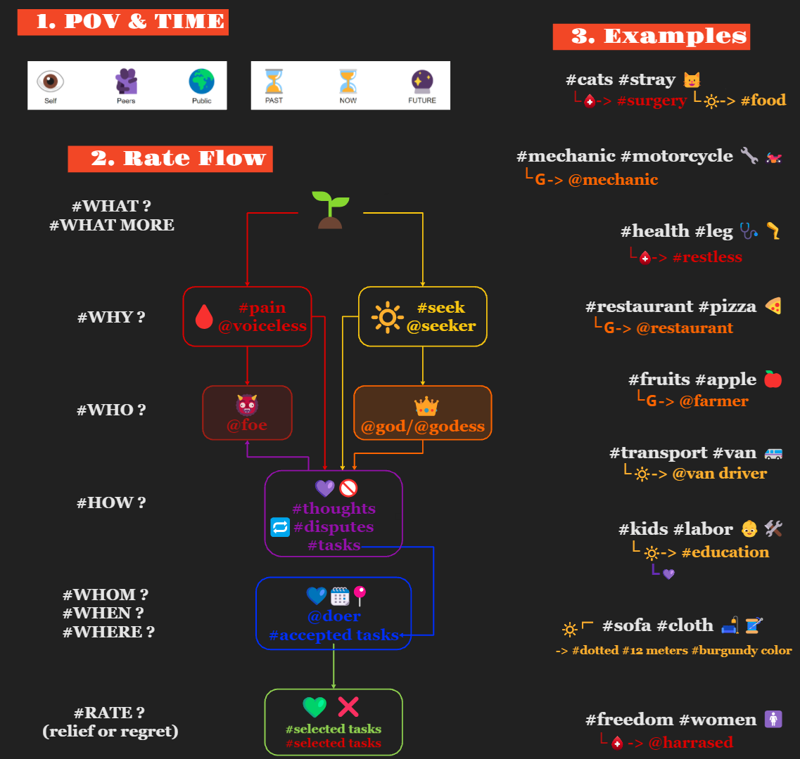
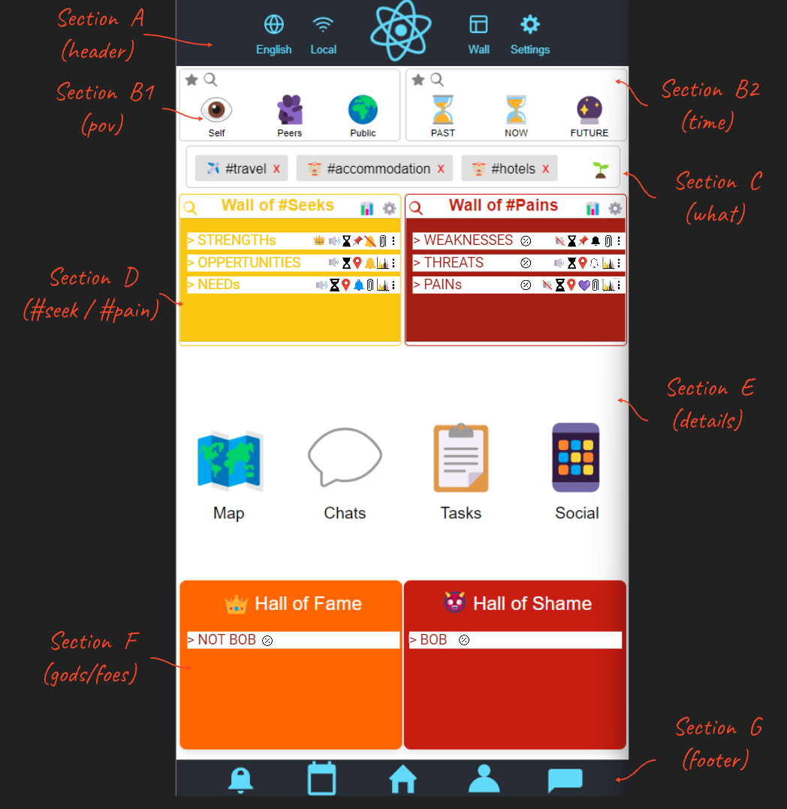
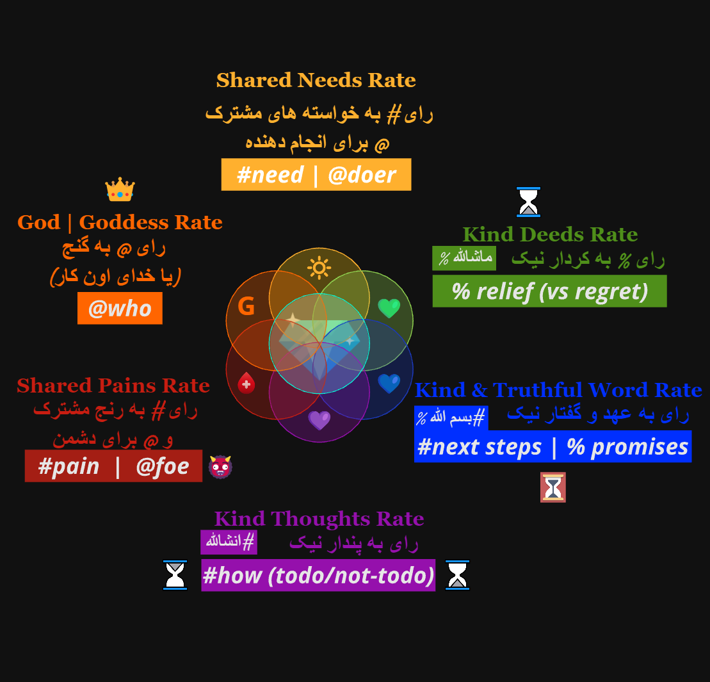

# DORR: Ratings Beyond Stars

## Introduction

**DORR** *(Definitions of Recurring Ranked Rates)* aims to shift away from the conventional **five-star rating systems** to a more meaningful and customizable ranking model. 

DORR provides dynamic, customizable, colorful rates representing different behaviours. With the power to connect via multiple options (e.g., Bluetooth, innovative P2P, LoRa, Torr, WebRTC, centralized servers, etc), DORR promotes a human-centered way of expressing experiences.

---

## Why DORR?

#### A Wise Man Once Said:
"A *truly happy & fortunate person* is one who **values the experiences of others**—both positive and negative. 
If we all learn from each other's experiences, the failures in our lives wouldn't be so abundant."

The current rating systems often fail to capture the complexity of human experiences, reducing nuanced feedback to a single, aggregated star rating. 

DORR seeks to enrich the process of giving and receiving feedback by providing a richer framework for evaluating interactions, experiences, and the impact of actions. With colorful icons, meaningful metrics, and customizable connections, DORR offers an innovative approach to highlight shared experiences that are about more than just five stars.

---

## Rating Flow Overview

1. **Step 1: Select Language, Network, Layout, and Related Settings**  
   Choose the preferred language, select the network connection (Local, Bluetooth, P2P, etc.), and pick a layout (Wall format). You can also manage settings such as creating profiles, adding SOS contacts, and adding peers.

2. **Step 2: Select POV/Time**  
   Choose the Point of View (POV) for (self, peers, public) and the timeline (past, now, future).

3. **Step 3: Select Hashtag Tree (WHAT)**  
   Navigate through the hashtag tree to select the category or item that best represents what you want to rate.

4. **Step 4: Select Pain or Gain (WHY) OR Add Foe or God (WHO)**  
   Choose whether you're addressing a pain (🩸) or a gain (🔆). Optionally add influences like foes (👹) or gods (👑).

5. **Step 5: Add Thoughts (HOW)**  
   Add relevant thoughts about the experience, either as actions to do (💜) or not to do (❌).

6. **Step 6: Add Promises (WHOM/WHEN/WHERE)**  
   Capture commitments or actions that will be done, including the person involved, location, and timing (💙).

7. **Step 7: Rate Deeds (Relief or Regret)**  
   Rate the deeds that have taken place using relief (💚) or regret (❌) icons to reflect the impact of those actions.

  
_Visual representation of the DORR rating flow_

---

## Sections Overview

  
_Visual representation of different DORR sections_

### Section A: Header and Navigation
- Header for language, network, and layout options.
- Navigation for information and setting page.

### Section B: Point of View (POV) and Time Selector
- Filters the ratings and experiences by different perspectives (self, peers, public).
- Filter by timeline (past, now, future).

### Section C: Hashtags
- Select the relevant hashtags tree (e.g., #cats or #pizza) you are interested in.
- Each hashtag can be assigned a color to represent different behaviours in the next sections.

### Section D: Wall of Seeks & Pains
- **D1**: Wall of Seeks - Displays lists of requests or "seeks" shared by others or oneself.
- **D2**: Wall of Pains - Displays experiences of pains, regrets, or challenges others have faced.
- Different levels of interaction: add, details, pin, broadcast, subscribe, etc.

### Section E: Map, Chats, Tasks & Social Media
- **E1**: Visual maps of where certain experiences are occurring.
- **E2**: Chat lists related to selected items.
- **E3**: Task lists related to selected items.
- **E4**: Social media feeds for selected items.

### Section F: Hall of Fame & Hall of Shame
- Displays highlighted contributions based on selected hashtags and filters.
- Recognizes users, experiences, and actions either in a positive (Hall of Fame) or negative (Hall of Shame) light.

### Section G: Footer
- Shortcuts for colorful icons for easier interaction with ratings.

---

## How DORR Works

  
_Visual representation of different DORR sections_

DORR is built on the idea of using a **rich, expressive ranking system** instead of the limiting five-star ratings. Ratings are ongoing, dynamic, and represent a wider array of experiences.

1. **Capturing the Experience**: Select a POV, assign meaningful hashtags, and use colored rates to represent pains, gains, or other facets of the experience.
2. **Customizable Connections**: Whether you’re using innovative P2P technologies, Bluetooth, or other communication methods, you can connect to multiple networks, broadcast, or receive ratings—all within a single app.
3. **Recurring Interactions**: Instead of leaving experiences rated once, users can continuously update the status of an interaction as it evolves.

---

## Running Locally

1. Clone the repository: `git clone https://github.com/rougebros/dorr.git`
2. Install dependencies: `npm install`
3. Start the server: `npm start`

Make sure to have [Node.js](https://nodejs.org/) and [npm](https://www.npmjs.com/) installed.

---

## Contributing

Contributions are warmly welcomed! Whether you’re a developer, designer, or simply passionate about transforming rating systems:

- **Comment on SWOT or Project Links**
- **Fork the repository**
- **Create a feature branch**
- **Submit a pull request**

Feel free to explore open issues or propose new features!

---

## Contact

If you have any questions or feedback, please reach out:

- **Email**: rougebros@gmail.com
- **GitHub**: [rougebros](https://github.com/rougebros/dorr)

Together, let’s create a future where every experience is rated with true depth!

---

## License

DORR is open-source and available under the MIT License.

---

## Additional Resources

- [SWOT Analysis](https://docs.google.com/spreadsheets/d/1YWogPVsf1BwZtVXYDJ-wCnU1yS5HVwWM_RsftsBpBDE)
- [Project Documentation](https://docs.google.com/document/d/1lD7nrnuxVRRinCb6HwbX5E-hdAyT_ePMl3l60wewWQQ)
- [An Old Presentations](https://docs.google.com/presentation/d/1RzFvezBZFz1p7q7fKkBV49bZeQtI7O7pgm3tKMw0-f4/)
- [Miro](https://miro.com/welcome/dzZyOUhGQUNsUDNkYmdqR0xUTGk1MThpcGZrWTQ4d1R4WDF0RHZaS21uelVvam00YXRHenVlVkU1RmlUTW5uNXwzMDc0NDU3MzQ3NjAyODExMTYwfDM=?share_link_id=818575512783)
- [Video Walkthrough] TBA
