# DORR: Ratings Beyond Stars

## Introduction

**DORR** *(Definitions of Recurring Ranked Rates)* moves beyond conventional **five-star rating systems** to a more nuanced, human-centered model of experience sharing. 

DORR enables dynamic, customizable, and colorful ratings to represent diverse behaviors and sentiments. Through multi-channel connectivity (Bluetooth, P2P, LoRa, Torr, WebRTC, centralized servers, and more), DORR facilitates a new way to express and exchange experiences.

## Why DORR?

#### A Thoughtful Perspective:
"A *truly happy and fortunate person* is one who **values the experiences of others**—both positive and negative. When we learn from each other’s insights, we can avoid repeating avoidable mistakes and elevate our understanding.”

Traditional rating systems often oversimplify experiences into aggregated stars, missing the complexity and context that human feedback deserves. DORR seeks to restore depth and nuance to how we rate, respond, and connect.

## Value Proposition

DORR redefines both **C2C and C2B** interactions, moving beyond the star system to foster meaningful connections. With **six vibrant colors** for tags, hashtags, and notifications, DORR allows individuals to express experiences and needs precisely, helping shift the supply-demand paradigm into a more community-driven **demand-supply** approach. By focusing on what truly matters, DORR minimizes reliance on middlemen.

## Purpose and Mission

DORR empowers individuals to **share experiences**, learn from one another, and express needs in a transparent, human-centered way. Designed for independence from platform-driven control, DORR supports direct, community-focused interactions where **users retain control** over their experiences, making connections without unnecessary intermediaries.

## A Unique Perspective on Sharing

Each tag, experience, and hashtag within DORR represents more than data—it’s a piece of human insight. DORR’s color-coded system brings clarity and emphasis, allowing users to categorize items like urgent needs, new opportunities, or supportive presences in their community. This layered, colorful approach provides context beyond mere words or ratings.

## The Path Forward

Inspired by Unix’s open-source legacy, DORR adopts a collaborative, flexible structure that allows communities to grow meaningfully. While free to use, DORR generates value by empowering individuals to share their experiences openly and benefit from others' wisdom, not by profit-driven motives. With DORR, the community shapes the platform, creating a shared space for experiences, needs, and insights.

## A Note on Open Source

DORR’s code is open-source, emphasizing transparency and accessibility. Like the foundations of **Unix**, DORR operates on principles of community contribution and user empowerment—free from hidden motives, and designed to connect people authentically.

---

## Sections Overview

### Section A: Header and Navigation
- Header for language, network, and layout options.
- Navigation for information and settings page.

  
_Visual representation of Section A_

### Section B: Point of View (POV) and Time Selector
- Filters the ratings and experiences by different perspectives (self, peers, public).
- Filter by timeline (past, now, future).

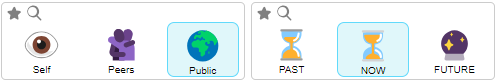  
_Visual representation of Section B_

- You can make your filter more precise by double clicking any of the icons:

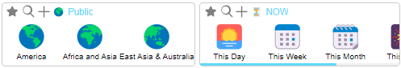  
_Visual representation of Section B2_

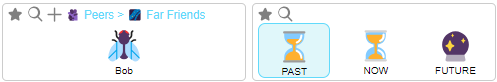  
_Visual representation of Section B3_

### Section C: Hashtags
- Select the relevant hashtag tree (e.g., #cats or #pizza) you are interested in.
- Each hashtag can be assigned a color to represent different behaviors in the next sections.

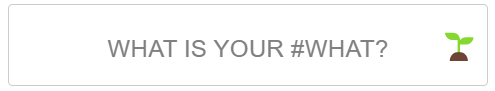  
_Visual representation of Section C_

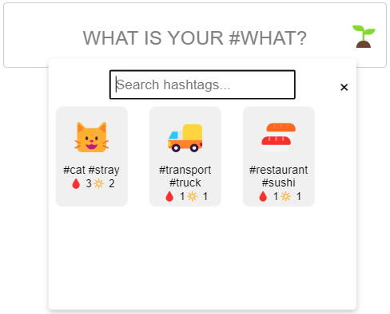  
_Visual representation of Section C2_

### Section D: Wall of Seeks & Pains
- **D1**: Wall of Seeks - Displays lists of requests or "seeks" shared by others or oneself.
- **D2**: Wall of Pains - Displays experiences of pains, regrets, or challenges others have faced.
- Various interaction options: add, view details, pin, broadcast, subscribe, etc.

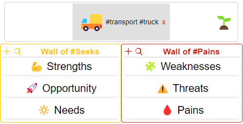  
_Visual representation of Section D_
- If you are selecting the **self** filter, then you can decide who to broadcast that need/pain to.

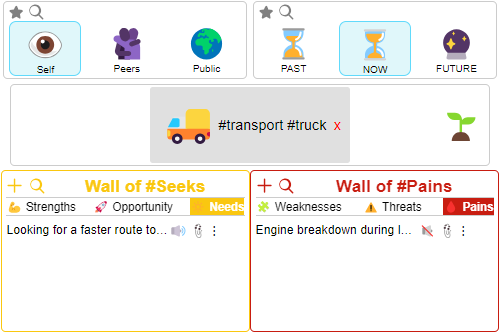  
_Visual representation of Section D2_
- If you are selecting the **public/peer** filters, then you can decide who to receive notif of that need/pain from.

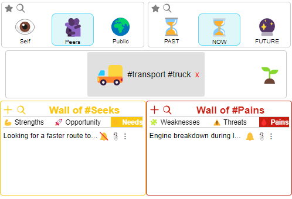  
_Visual representation of Section D3_

- **Expand View / Details**: TBA

### Section E: Map, Chats, Tasks & Social Media
- **E1**: Visual maps of where certain experiences are occurring.
- **E2**: Chat lists related to selected items.
- **E3**: Task lists connected to selected items.
- **E4**: Social media feeds for selected items.

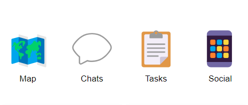  
_Visual representation of Section E_

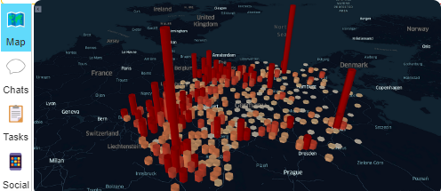  
_Visual representation of Section Map_

### Section F: Hall of Fame & Hall of Shame
- Displays highlighted contributions based on selected hashtags and filters.
- Recognizes users, experiences, and actions either in a positive (Hall of Fame) or negative (Hall of Shame) light.

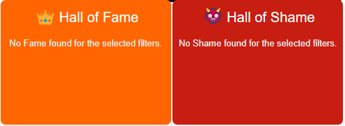  
_Visual representation of Section F_

### Section G: Footer
- Customizable shortcuts with colorful icons for easier interaction with ratings.

### Overview of All Sections:
  
_Visual representation of different DORR sections_

---

# How DORR Works

## 6 Colorful Rates
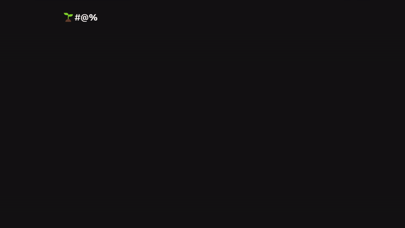

DORR is built on the idea of using a **rich, expressive ranking system** instead of the limiting five-star ratings. Ratings are ongoing, dynamic, and represent a wider array of experiences.

1. **Capturing the Experience**: Select a POV, assign meaningful hashtags, and use colored rates to represent pains, gains, or other facets of the experience.
2. **Customizable Connections**: Whether you’re using innovative P2P technologies, Bluetooth, or other communication methods, you can connect to multiple networks, broadcast, or receive ratings—all within a single app.
3. **Recurring Interactions**: Instead of leaving experiences rated once, users can continuously update the status of an interaction as it evolves.
4. **Tasks & Chats**: Keeping these two items next to each other is a must for any team or project.

---
## Flow & Examples

  
_Visual representation of the DORR rating flow_

## Running Locally

1. Clone the repository: `git clone https://github.com/rougebros/dorr.git`
2. Install dependencies: `npm install`
3. Start the server: `npm start`

Make sure to have [Node.js](https://nodejs.org/) and [npm](https://www.npmjs.com/) installed.

---

## Contributing

Contributions are warmly welcomed! Whether you’re a developer, designer, or simply passionate about transforming rating systems:

- **Comment on SWOT or Project Links**
- **Fork the repository**
- **Create a feature branch**
- **Submit a pull request**

DORR is open-source, and contributions are welcome. For any questions or suggestions, feel free to open an issue or reach out.

---

## Contact

If you have any questions or feedback, please reach out:

- **Email**: rougebros@gmail.com
- **GitHub**: [rougebros](https://github.com/rougebros/dorr)

Together, let’s create a future where every experience is rated with true depth!

---

## License

DORR is open-source and available under the MIT License.

---

## Additional Resources

- [SWOT Analysis](https://docs.google.com/spreadsheets/d/1YWogPVsf1BwZtVXYDJ-wCnU1yS5HVwWM_RsftsBpBDE)
- [Project Documentation](https://docs.google.com/document/d/1lD7nrnuxVRRinCb6HwbX5E-hdAyT_ePMl3l60wewWQQ)
- [An Old Presentations](https://docs.google.com/presentation/d/1RzFvezBZFz1p7q7fKkBV49bZeQtI7O7pgm3tKMw0-f4/)
- [Miro](https://miro.com/welcome/dzZyOUhGQUNsUDNkYmdqR0xUTGk1MThpcGZrWTQ4d1R4WDF0RHZaS21uelVvam00YXRHenVlVkU1RmlUTW5uNXwzMDc0NDU3MzQ3NjAyODExMTYwfDM=?share_link_id=818575512783)
- [Video Walkthrough] TBA
